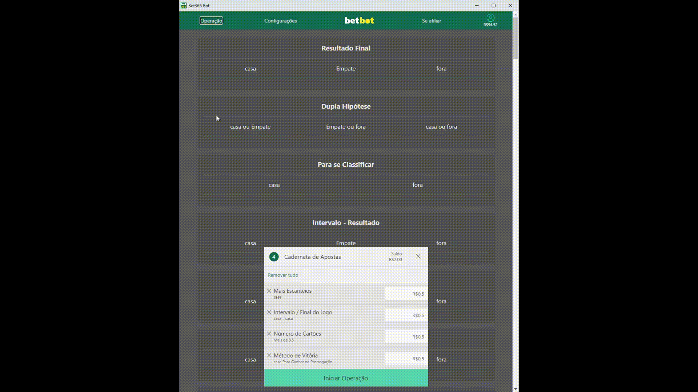

## [BetBot]


## O que é necessário para rodar
- Firefox com o Gecko Driver instalado
- Python com as dependências listadas no requirements.txt
- Cluster MongoDB com uma Collection chamada users
- Conta na Bet365 para entrar no site 

## Como rodar o projeto
1. Instale o python 3.9, e na raiz do projeto instale as [dependências](../requirements.txt):

```bash
pip install -r requirements.txt
```

2. Certifique-se que tem uma conta na [Bet 365](https://www.bet365.com/), e pegue o seu nome de usuário e senha.

3. Certifique-se que tem o [Firefox](../src/widgets.py) instalado com o seu respectivo [Gecko Driver](https://www.take.net/blog/wp-content/cache/wp-rocket/take.net/blog/take-test/instalacao-geckodriver-driver-para-abrir-o-firefox-no-selenium/index-https.html_gzip), lembrando que é possível usar o Chrome mudando o FirefoxBrowser para ChromeBrowser no bot.py junto com a instalação do respectivo chromedriver.

4. Crie uma conta no [MongoDB](https://medium.com/reprogramabr/conectando-no-banco-de-dados-cloud-mongodb-atlas-bca63399693f#:~:text=Acesse%20ao%20site%20do%20MongoDB,esquerdo%2C%20clique%20em%20Database%20Access.) no caso de usar o FirefoxBrowser, ou use o ChromeBrowser no [bot.py](../src/bot.py) com o chromedriver.

5. Crie um arquivo na raiz do projeto chamado env.py com a [autenticação](https://docs.atlas.mongodb.com/tutorial/connect-to-your-cluster/) do seu Mongo, sem os <>:

```py
autenticacao = "mongodb+srv://<USUARIOMONGO>:<SENHAMONGO>@cluster<CLUSTERID>.mongodb.net/betbot?retryWrites=true&w=majority"
```

6. Adicione a seguinte linha no final do [database.py](../src/database.py) na primeira vez para criar o seu usuário no banco de dados usando a sua conta da Bet 365:

```py
MongoDB.cadastrar("NOMEDOUSUARIO", "SENHA") # Nome do usuário da conta da Bet e sua senha
```

7. Inicie o [main.py](../main.py) e faça o login, e então retire a linha adicionada anteriormente.


